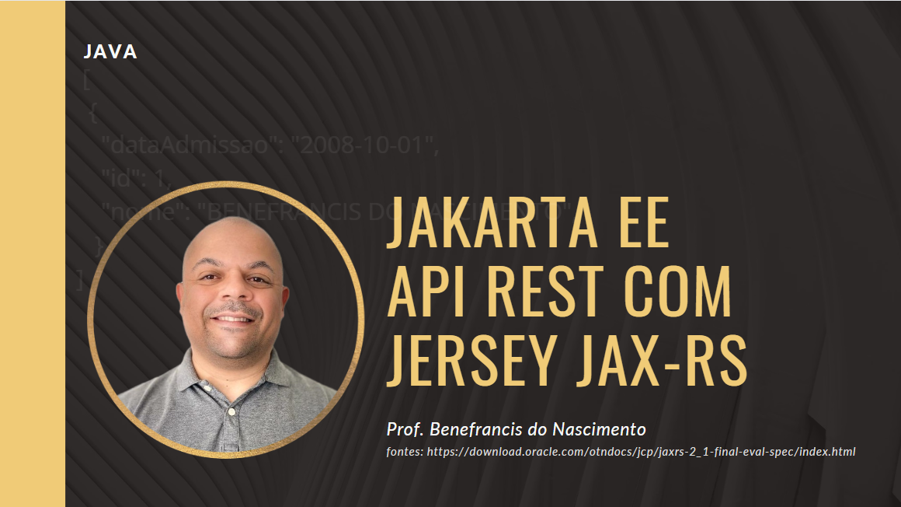

# Vídeo Tutorial

# Aplicação JAVA API REST

Uma das alternativas para o Spring Boot, a JAX-RS API é uma especificação que define interfaces e anotações fornecidas pelo Java EE, que podem ser utilizadas na criação de uma API RESTfull.

Entre as bibliotecas existentes, a  implementação da JAX-RS API mais conhecida e utilizada é a Jersey.

  
# executar
Para executar o projeto basta rodar no prompt (necessário ter o maven instalado e configirado nas variáveis de ambiente):

	mvn exec:java

O comando acima dá o start no servidor Payara embutido na aplicação que provê nossa API REST.

